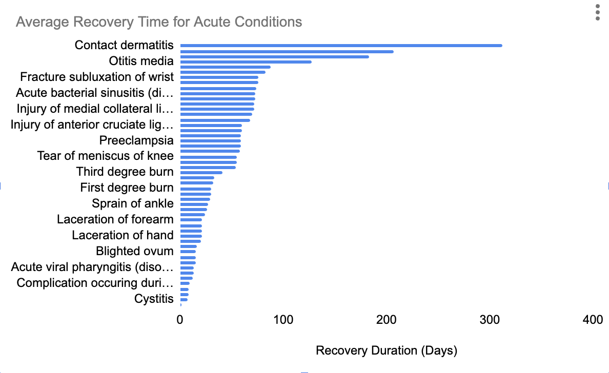
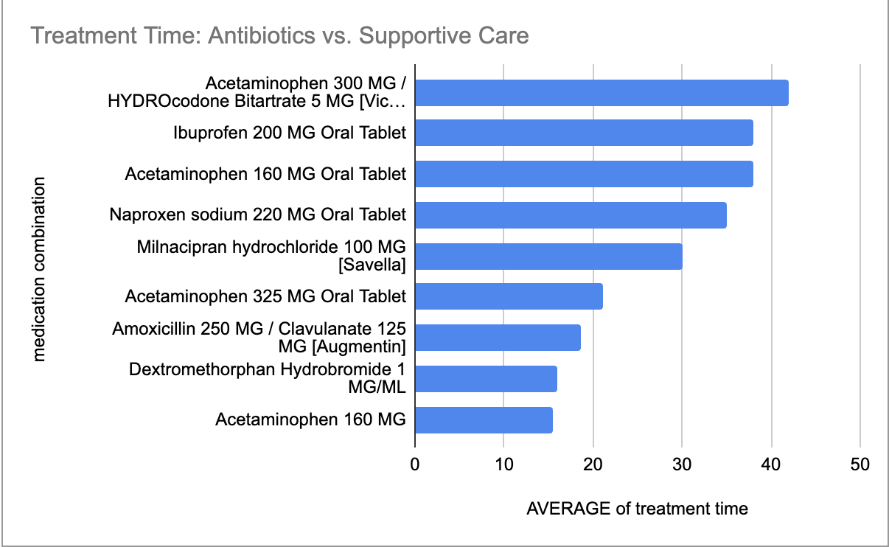

Healthcare Efficiency Analysis (SQL)
Overview
Analysis of patient recovery patterns using BigQuery (SQL). The project focuses on distinguishing between chronic and acute conditions to measure healthcare delivery efficiency.

Visualizations
Acute Conditions: Average Recovery Time

Insights: Skin conditions and fractures show the longest recovery cycles among acute cases.

Data & Tech Stack
SQL (Google BigQuery): Multi-table joins and data transformation.

Data Modeling: Transformed raw Synthea data into a relational structure (Patients, Encounters, Conditions).

Data Cleaning: Handled NULL values in recovery dates and filtered out duration anomalies.

Business Logic
Segmentation: Conditions >365 days are categorized as Chronic to avoid skewing "Acute" efficiency metrics.

Metric: Used DATE_DIFF to calculate Recovery_Days as a primary KPI.

Medication Effectiveness Analysis

Logic: Integrated Conditions and Medications datasets via ENCOUNTER keys to align specific diagnoses with their respective treatments.

Metrics: Compared the actual illness duration against the prescribed medication course length.

Goal: Identify if longer medication courses correlate with faster recovery in acute cases.
"Data Discovery: Treatment Variability"

Finding: While respiratory conditions show a high correlation with antibiotic prescriptions (e.g., Amoxicillin), skin conditions like Contact dermatitis often have no linked medication records.

Technical Solution: Used LEFT JOIN and COALESCE to identify these gaps instead of simply ignoring them with a standard JOIN

I discovered a discrepancy where respiratory infections were linked to long-term hormonal treatments. This is a common feature of clinical databases where active chronic medications are recorded alongside acute prescriptions during a single patient encounter. To ensure the integrity of my recovery analysis, I implemented a 'Black-list' filter to isolate only relevant acute treatments.

The analysis shows that simple supportive treatments (like Acetaminophen) average 15-20 days, while more intensive combinations involving antibiotics or specific tablets can extend to 40 days of tracked medication stop dates.